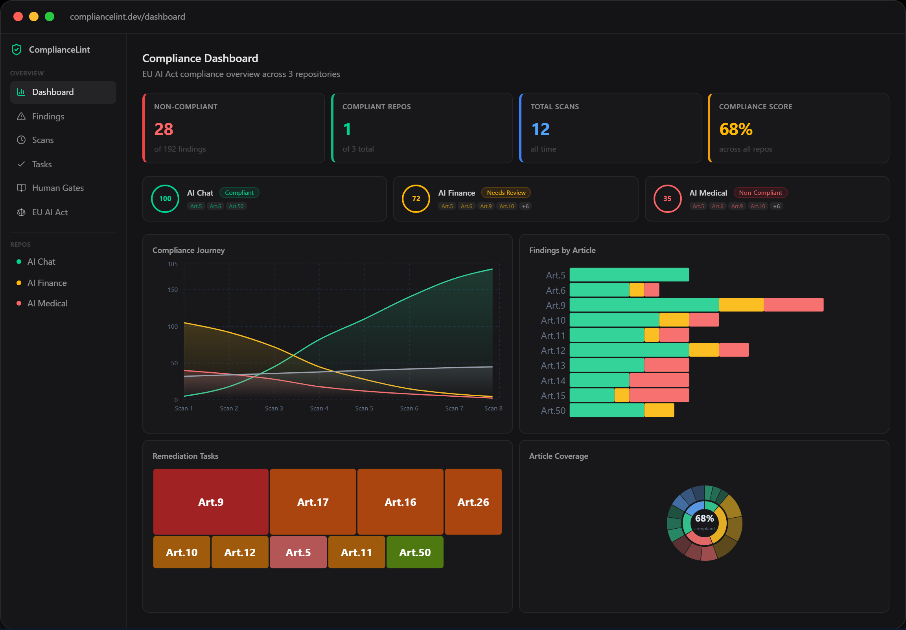

# ComplianceLint

[](LICENSE)
[](https://www.python.org/)
[](https://modelcontextprotocol.io/)
[](https://compliancelint.dev)

**Compliance in your IDE. Not in a meeting.**

From EU AI Act code to audit-ready evidence — in one workflow, inside the tools you already use.

Scan, attest, and document EU AI Act compliance without leaving your IDE. The scanner catches code-verifiable violations, AI collects evidence for hybrid obligations, and structured Human Gates capture pure attestations — all with audit trail. Your code never leaves your machine.

> **2026-08-02** — EU AI Act high-risk requirements become enforceable. ComplianceLint helps you prepare now.

> **Note:** ComplianceLint is a compliance engineering tool, not a law firm. It gives you a structured, evidence-based path toward compliance — but final legal decisions should always involve qualified legal counsel.

### See it in action

**Demo: scanning an AI chatbot** (limited risk — all applicable obligations verified):

https://github.com/user-attachments/assets/0816cc3c-e848-4080-a863-8ed4dffef487

Watch a full compliance scan: from non-compliant to fully verified in under 2 minutes.

> **More demos:** <a href="https://github.com/user-attachments/assets/591ca74c-e2c5-450a-9055-7a827c21ad42" target="_blank">AI Finance (high-risk)</a> · <a href="https://github.com/user-attachments/assets/e74e2613-2f82-4d43-96e3-94279e6f68dd" target="_blank">AI Medical (high-risk)</a>

### Dashboard



Track compliance across all your AI systems. Export audit-ready PDF reports. [Try the live demo →](https://compliancelint.dev/demo)

### Documentation

Full user manual at **[compliancelint.dev/docs](https://compliancelint.dev/docs/quick-start)** — 30 chapters covering setup, daily use, persona-specific reference (Provider / Deployer / Authorised Representative / Importer / Distributor), and troubleshooting.

---

## Who Needs This

- **AI product teams** — building chatbots, recommendation engines, content generation, or any AI-powered feature
- **Solo developers & founders** — shipping AI products and need to know if they comply before enforcement begins
- **CTOs & engineering leads** — need compliance visibility without hiring a legal team
- **Compliance officers** — want code-level evidence, not just checkbox questionnaires

If your software uses AI and you serve EU customers, the EU AI Act applies to you.

---

## Quick Start

**Prerequisites:** Python 3.10+ is required.

### Option A: npx (recommended)

```bash
npx compliancelint init
```

Auto-detects your environment, installs dependencies, and configures everything. Then reload your IDE window.

### Option B: pip install

```bash
pip install compliancelint
python -m scanner.cli init
```

After setup, reload your IDE window so it picks up the new MCP server, then ask:

> "Scan my project for EU AI Act compliance."

No extra API key needed — uses your existing AI subscription.

### Track over time (optional)

> "Connect to ComplianceLint dashboard."

Opens browser, links your dashboard at [compliancelint.dev](https://compliancelint.dev).

> "Sync my compliance results."

Uploads findings to your dashboard. Code never leaves your machine — only compliance findings, evidence submissions, remediation progress, and attestation records are synced. This builds an auditable compliance trail that demonstrates your ongoing compliance efforts to regulators and legal counsel.

---

## What You Get

```
Art. 12 — Record-keeping                            NON-COMPLIANT

┌──────────────┬────────────┬──────────────────────────────────────────┐
│ Obligation   │ Status     │ Description                              │
├──────────────┼────────────┼──────────────────────────────────────────┤
│ ART12-OBL-1  │ COMPLIANT      │ Logging detected (structlog)         │
│ ART12-OBL-2a │ NON_COMPLIANT  │ Risk event logging not found         │
│ ART12-OBL-4  │ NON_COMPLIANT  │ No retention policy documented       │
│ ART12-OBL-3a │ NOT_APPLICABLE │ Not a biometric system               │
└──────────────┴────────────┴──────────────────────────────────────────┘

Legal citation: Art. 12(1): "High-risk AI systems shall technically allow
for the automatic recording of events (logs)..."
```

Every finding includes:
- **Exact legal citation** — verbatim from EUR-Lex
- **Obligation ID** — traceable to our structured obligation database
- **AI evidence** — what the AI found (or didn't find) in your code
- **Remediation steps** — how to fix it

---

## From Non-Compliant to Compliant

ComplianceLint doesn't just find problems — it helps you fix them.

### 1. Get a remediation plan

> "Give me an action plan to fix my compliance issues."

The AI generates a prioritized plan with effort estimates — what to fix first, what code to change, and what documentation to add.

### 2. Fix and re-scan

Make the changes, then scan again. ComplianceLint tracks what improved and what's still open.

### 3. Record evidence

> "I've fixed the logging issue. Please re-check and update the finding."

The AI verifies your fix, updates the finding status, and records who made the change and when — ready for auditors.

### 4. Track your journey

Each scan is a snapshot. Over time, your dashboard shows the full compliance journey — from first scan to fully compliant. Export a PDF for your auditor or investor at any point.

---

## Dashboard

Track compliance over time at **[compliancelint.dev](https://compliancelint.dev)**:

- **Compliance Journey** — visualize progress from non-compliant to compliant over time
- **Findings by article** — bar chart of issues per EU AI Act article
- **Tasks** — prioritized remediation to-do list with severity and effort estimates
- **Scan History** — full audit trail of every scan, with diff between consecutive scans
- **PDF reports** — export audit-ready reports with legal citations
- **Attestation** — record human review decisions with evidence (cl_update_finding)
- **Evidence stays in your repo** — upload files from the dashboard; bytes commit to `.compliancelint/evidence/` in your git repo. We relay transiently, never hold your files.
- **Human Gates** — guided questionnaires for obligations that require human verification (DPIA, oversight assignments, worker notifications)
- **Role selection** — filter obligations by your EU AI Act role (Provider, Deployer, Authorised Representative, Importer, Distributor) for accurate scoring

```
"Connect to ComplianceLint dashboard and sync my scan results."
```

---

## Why ComplianceLint

| | Other tools | ComplianceLint |
|-|------------|----------------|
| **Method** | Check if `RISK_MANAGEMENT.md` exists | AI reads entire codebase, checks against 247 decomposed legal obligations |
| **Citations** | "You need logging" | `Art. 12(1): "High-risk AI systems shall technically allow for the automatic recording of events..."` |
| **False positives** | Keyword matching → many | AI understands context → near zero |
| **Privacy** | Cloud upload | **100% local** — code never leaves your machine |
| **Cost** | Separate subscription | **Free + source-available (BSL 1.1)** — uses your existing AI IDE |

---

## "Can't I just ask Claude / ChatGPT to check my compliance?"

You can ask any AI to review your code. But here's the difference:

| | AI chat (Claude, ChatGPT, etc.) | ComplianceLint |
|-|--------------------------------|----------------|
| **Legal structure** | "You probably need logging" — vague, based on general knowledge | 247 specific obligations decomposed from actual EU AI Act articles |
| **Consistency** | Ask twice, get two different answers | Deterministic engine — same code, same result, every time |
| **Completeness** | AI decides what to check (and what to skip) | Every obligation is checked — nothing is missed |
| **Citations** | May hallucinate article numbers | Every finding traced to verbatim EUR-Lex source text |
| **Evidence trail** | Chat transcript (not audit-ready) | Per-obligation findings with timestamps and attestation records |
| **Progress tracking** | Start from scratch every conversation | Persistent history — scan today, compare with last month |
| **Team visibility** | Stuck in one person's chat window | Dashboard for your whole team (PMs, lawyers, auditors) |

**ComplianceLint uses your AI too** — Claude, GPT, or any AI reads the code. But instead of relying on the AI's general knowledge of the law, your answers go through a **verified obligation engine** built from the actual legal text. The AI is the eyes. The engine is the brain.

---

## Coverage

**EU AI Act** (Regulation (EU) 2024/1689) — 44 articles, 247 obligations:

| Article | Topic | Obligations |
|---------|-------|:-----------:|
| Art. 4 | AI literacy | 1 |
| Art. 5 | Prohibited AI practices | 8 |
| Art. 6 | Risk classification | 8 |
| Art. 8 | Compliance with requirements | 2 |
| Art. 9 | Risk management system | 19 |
| Art. 10 | Data governance | 11 |
| Art. 11 | Technical documentation | 9 |
| Art. 12 | Record-keeping (logging) | 11 |
| Art. 13 | Transparency | 4 |
| Art. 14 | Human oversight | 6 |
| Art. 15 | Accuracy & robustness | 8 |
| Art. 16 | Provider obligations | 12 |
| Art. 17 | Quality management system | 16 |
| Art. 18 | Documentation keeping | 2 |
| Art. 19 | Automatically generated logs | 3 |
| Art. 20 | Corrective actions | 3 |
| Art. 21 | Cooperation with authorities | 2 |
| Art. 22 | Authorised representatives | 4 |
| Art. 23 | Obligations of importers | 8 |
| Art. 24 | Obligations of distributors | 8 |
| Art. 25 | Value chain responsibilities | 7 |
| Art. 26 | Deployer obligations | 11 |
| Art. 27 | Fundamental rights impact assessment | 4 |
| Art. 41 | Common specifications | 1 |
| Art. 43 | Conformity assessment | 4 |
| Art. 47 | EU declaration of conformity | 4 |
| Art. 49 | Registration | 3 |
| Art. 50 | Transparency obligations | 10 |
| Art. 51 | GPAI classification (systemic risk) | 3 |
| Art. 52 | Classification notification procedure | 5 |
| Art. 53 | GPAI provider obligations | 8 |
| Art. 54 | GPAI authorised representatives | 6 |
| Art. 55 | GPAI systemic risk obligations | 6 |
| Art. 60 | Real-world testing | 4 |
| Art. 61 | Informed consent for testing | 2 |
| Art. 71 | EU database | 2 |
| Art. 72 | Post-market monitoring | 4 |
| Art. 73 | Serious incident reporting | 6 |
| Art. 80 | Non-high-risk misclassification | 3 |
| Art. 82 | Compliant AI presenting risk | 1 |
| Art. 86 | Right to explanation | 3 |
| Art. 91 | Documentation duty | 1 |
| Art. 92 | Cooperation with evaluations | 1 |
| Art. 111 | Transitional provisions | 3 |

All obligations verified against EUR-Lex source text.

**Why 44 of 113 articles?** The EU AI Act contains 113 articles. ComplianceLint covers the 44 that impose technical or organizational obligations on AI providers, deployers, and distributors. The remaining articles define terminology (Art. 1–3), establish governance bodies (Art. 28–40, 56–59, 64–70), set penalties (Art. 83–85, 99), and contain procedural/transitional provisions — none of which create scannable compliance requirements for software teams.

Not all 44 articles apply to every project. The applicable obligations depend on your role (provider, deployer, authorised representative, importer, distributor) and risk classification. Configure your role in the [dashboard](https://compliancelint.dev) for accurate scoring.

---

## MCP Tools

| Tool | Purpose |
|------|---------|
| `cl_scan` | Scan article(s) — `cl_scan(regulation="eu-ai-act", articles="12")` or `articles="all"` |
| `cl_scan_all` | Scan all articles in a regulation at once (summary report) |
| `cl_analyze_project` | Understand project structure before scanning |
| `cl_explain` | Plain-language explanation of any article |
| `cl_action_plan` | Prioritized remediation plan with effort estimates |
| `cl_update_finding` | Submit evidence, rebuttals, acknowledgements |
| `cl_update_finding_batch` | Batch-update multiple findings at once |
| `cl_verify_evidence` | Verify submitted evidence |
| `cl_interim_standard` | Generate interim compliance standard for an article |
| `cl_connect` | Link to dashboard (browser OAuth) |
| `cl_sync` | Upload scan results to dashboard |
| `cl_disconnect` | Remove dashboard connection (preserves local data) |
| `cl_delete` | Delete with scope — `target="local"` (scan cache only, preserves evidence + rc), `target="all"` (local + evidence + rc), `target="dashboard"` (server-side purge) — all require explicit `confirm=true` |
| `cl_action_guide` | Get guidance for Human Gate obligations (directs to dashboard) |
| `cl_check_updates` | Enforcement deadlines and regulation status |
| `cl_version` | Show ComplianceLint version |
| `cl_report_bug` | Generate privacy-scrubbed bug-report bundle for GitHub issues |

All scanning tools accept a `regulation` parameter (default: `"eu-ai-act"`), designed to support multiple regulations as they are added.

---

## Project Structure

```
scanner/
├── server.py                 MCP Server entry point
├── core/
│   ├── obligation_engine.py  Obligation-driven analysis
│   ├── context.py            AI-to-scanner bridge
│   ├── config.py             Project configuration
│   └── state.py              Scan persistence + project identity
├── modules/                  Per-article scanning modules
├── obligations/              Obligation JSONs (structured legal requirements)
└── tests/                    Unit + integration tests
```

---

## Git-native by design

ComplianceLint treats your git repository as the primary evidence store,
not our SaaS. Five architectural commitments:

1. **Evidence commits to your repo.** Bytes land at
   `.compliancelint/evidence/{finding_id}/{filename}` — you own them,
   you can grep them, they survive if we vanish. A sibling `manifest.json`
   under the same directory records who uploaded what, when, and at which
   sha — the audit-trail primary record. Scan cache (state.json, per-
   article results, baselines) lives in `.compliancelint/local/` and is
   gitignored; only evidence and the `.compliancelintrc` project binding
   are committed.

2. **MCP never runs git on your behalf.** No auto-commit, no auto-push,
   no auto-revert. Every commit is your decision. If you commit locally
   without pushing, `cl_sync` waits until you push.

3. **Git-host neutral.** Works with GitHub, GitLab, Bitbucket, Gitea,
   Azure DevOps, self-hosted, or a purely local repo. MCP commits
   locally using your existing git config + SSH agent — no credentials
   shared with our SaaS. Planned OAuth integration for GitHub and
   GitLab (post-launch) will offer direct SaaS commits as an opt-in
   convenience; the MCP path always remains supported.

4. **Force-push aware.** If you rewrite history and erase an evidence
   commit, the next `cl_sync` detects the missing file and flags it on
   the dashboard (`health_status='broken_link'`). The forensic record
   stays — who uploaded, when, at which sha — even after the bytes
   are gone from git.

5. **Snapshot ledger is your integrity anchor.** Every scan writes a
   deterministic hash (`sort_keys` + UTC ISO + fixed-precision floats)
   of findings + evidence state. Reproduce on any machine; compare to
   catch silent mutations. Git history is *not* the audit trail —
   the snapshot ledger is.

---

## Pricing

The scanner is **free and source-available** ([BSL 1.1](LICENSE)). The dashboard is freemium:

| | Free | Starter (€19/mo) | Pro (€99/mo) | Business (€199/mo) | Enterprise |
|-|------|------------------|--------------|--------------------|------------|
| Projects | 1 | 2 | 10 | Unlimited | Unlimited |
| Scan history | 7 days | Unlimited | Unlimited | Unlimited | Unlimited |
| PDF reports | Watermarked | Clean | Clean | Clean | Clean |
| All 247 obligations visible (worst-case) | ✓ | ✓ | ✓ | ✓ | ✓ |
| **Scope narrowing** — see only obligations applicable to your AI system (typically saves ~70% review time) | — | ✓ | ✓ | ✓ | ✓ |
| **Risk classification picker** (Art. 5 / 6 / 50) | — | ✓ | ✓ | ✓ | ✓ |
| **SME relief** (Art. 11 simplified tech-doc per Recommendation 2003/361/EC) | — | ✓ | ✓ | ✓ | ✓ |
| **Per-obligation questionnaires** (anchor AI answers to verbatim legal text) | — | ✓ | ✓ | ✓ | ✓ |
| **Art. 2 carve-outs** (territorial / military / research / open-source — entire-Act exemption flags) | — | ✓ | ✓ | ✓ | ✓ |
| Penalty display (worst-case Art. 99 caps) | ✓ | ✓ | ✓ | ✓ | ✓ |
| Penalty configuration (precise — based on your headcount + turnover + balance sheet) | — | ✓ | ✓ | ✓ | ✓ |
| Risk mapping (MIT AI Risk Repository) | — | ✓ | ✓ | ✓ | ✓ |
| Evidence references (URL, text) | — | — | ✓ | ✓ | ✓ |
| Human Gates questionnaires | — | — | ✓ | ✓ | ✓ |
| Evidence file upload to your repo | — | — | ✓ | ✓ | ✓ |
| SARIF export | — | — | ✓ | ✓ | ✓ |
| CI/CD quality gate | — | — | ✓ | ✓ | ✓ |
| Multi-framework mapping (ISO 42001, NIST AI RMF) | — | — | — | ✓ | ✓ |
| Regulation updates | — | — | — | ✓ | ✓ |
| Compliance All-in-One Pack (audit-grade snapshot zip) | — | — | — | ✓ | ✓ |
| SSO / SAML / on-prem | — | — | — | — | ✓ |
| Team members | Unlimited | Unlimited | Unlimited | Unlimited | Unlimited |

**Evidence stays in your repo.** Upload files from the dashboard — bytes commit to `.compliancelint/evidence/` in your git repo. We relay transiently. We never hold your files.

**Team members are free + unlimited.** Invited members inherit the owner's tier — Pro members get Human Gates, Business members get Time Capsule exports. No per-seat billing. All actions are audit-logged with the actor's identity.

---

## Roadmap

### Shipped

- [x] MCP Server (17 tools) + 44 EU AI Act articles, 247 obligations
- [x] SaaS Dashboard with Compliance Journey tracking
- [x] PDF exports (Scan Report, Journey, Declaration of Conformity, Technical Documentation, Tasks)
- [x] Attestation system (evidence, rebuttals, acknowledgements, defer, questionnaire response)
- [x] `npx compliancelint init` — one-line setup
- [x] Role-based obligation filtering (Provider, Deployer, Authorised Representative, Importer, Distributor)
- [x] Human Gates — guided questionnaires for manual obligations
- [x] Settings audit trail — track who changed compliance settings
- [x] Evidence v4 deferred-path (browser upload → `.compliancelint/evidence/` → cl_sync pulls → user commits)
- [x] Project fingerprint detection (first_commit_sha mismatch → owner acknowledge)
- [x] Force-push broken_link detection (evidence health sweep on every cl_sync)
- [x] Stale-evidence banners (finding + repo level)
- [x] Snapshot ledger (deterministic state hash on every scan)
- [x] Directory v2 — local cache (`.compliancelint/local/`, gitignored) vs committed evidence (`.compliancelint/evidence/` + `manifest.json`) split
- [x] Cross-OS CI matrix (Ubuntu, macOS, Windows × Python 3.10–3.13)
- [x] Profiling Wizard — answer 6 questions about your AI system (EU establishment, Annex III category, training data, GPAI status) and the 247-obligation matrix is filtered down to the ~30–80 that actually apply to you (Starter+)
- [x] **Public EU AI Act browser at [`/eu-ai-act`](https://compliancelint.dev/eu-ai-act)** — full text of 44 articles + 13 annexes + searchable across 247 obligations, **no signup required**. Browse legal text + search "biometric" / "logging" / "human oversight" instantly

### Pre-launch

- [x] **Compliance Time Capsule** (Business+ tier) — historical snapshot zip with Declaration of Conformity + Technical Documentation + per-article PDFs + audit-trail CSV + an embedded HTML viewer (index/dashboard/tasks/human-gates pages SSR-rendered from the same React components the live SaaS dashboard uses, so the offline bundle stays in step with the dashboard automatically). 11/11 verifier-gated (`npx tsx dashboard/scripts/verify-time-capsule-phase-1-5.ts` exits 0).

### Post-launch (v2+)

- [ ] OAuth direct-commit integration — dashboard can commit evidence to cloud git without requiring MCP to be running (GitHub first, GitLab second; together they cover ~80% of cloud git users)
- [ ] GitHub Marketplace App (discovery + one-click install)
- [ ] **EU regulation expansion — "five-pillar" coverage roadmap** (expanding beyond EU AI Act, architecture-reuse-driven so each new regulation is ~3–4 weeks instead of starting from zero)
  - [ ] **Phase 2 — GDPR** (Regulation (EU) 2016/679, ~99 articles): personal-data processing for any SaaS handling EU users. Reuses our deontic-decomposition engine + Three Locks + Human Gates. Differentiator vs incumbent GDPR tools (Vanta / Drata / OneTrust): ComplianceLint runs *in your IDE* and auto-collects code-level evidence, instead of vendor-management questionnaires.
  - [ ] **Phase 3 — CRA** (Cyber Resilience Act, Reg (EU) 2024/2847, ~85 articles, full effect 2027): security-by-design + vulnerability handling + CE marking for any software product placed on the EU market. Highest market-fit for our IDE-attached architecture; very few code-level tools exist today.
  - [ ] **Phase 4 — NIS2** (Directive (EU) 2022/2555, ~46 articles): cybersecurity for "essential" + "important" entities (digital service providers, MSPs, healthcare, energy, etc.). Risk management, incident reporting, supply-chain security obligations.
  - [ ] **Phase 4 — DORA** (Reg (EU) 2022/2554, ~64 articles, in force 2025): ICT operational resilience for the financial sector. Incident reporting, third-party-risk register, threat-led penetration testing.
  - The five pillars (EU AI Act + GDPR + CRA + NIS2 + DORA) cover the legal stack a typical EU SaaS / regulated-industry deployment must satisfy. No existing tool we are aware of bundles all five at the code level.
- [ ] OSCAL export format (Business+ tier) — structured compliance data for enterprise audit workflows
- [ ] **Incremental scanning** — only re-scan obligations whose underlying code changed since the last `cl_scan_all`, instead of running every article every time. Demand-driven, triggered post-launch when usage warrants the optimization.
- [ ] **Human Gates evidence verifier** (`cl_verify_human_gates`) — AI cross-checks each questionnaire answer against the obligation's `source_quote` requirements; flags vague text, missing answers, and cross-obligation contradictions before re-scan promotes evidence to COMPLIANT.
- [ ] **Time Capsule `dashboard_state.json`** (post-launch, possibly tier-gated) — extend the export zip with a serialized snapshot of the dashboard's KPI cards, penalty calculation, role/risk-classification context, and per-article status matrix. Today the zip contains the legal artefacts (PDFs + manifest); this adds the *interpretive layer* the dashboard provides. Consumed by the offline viewer below.
- [ ] **Public Time Capsule viewer** (`/viewer`, post-launch, possibly tier-gated) — public, no-login web page where an auditor or external lawyer drag-drops a Time Capsule zip and the page renders the same KPI cards, penalty estimates, and article-status visualisations as the live dashboard, all client-side from the zip's `dashboard_state.json`. No backend hit. Closes the gap that today's zip is "audit-ready files" but not "audit-ready *interface*". Pricing tier and exact UX still TBD.

---

## Accuracy & Testing

| Metric | Value |
|--------|-------|
| Legal obligations covered | 247 (from 44 EU AI Act articles) |
| Test coverage | Unit + integration + e2e (scanner pytest, dashboard Vitest, Playwright) |
| Archetype test fixtures | Biometric systems to CRUD apps |
| Test pass rate | 100% |
| Obligation engine | Deterministic — same code, same result, every time |
| Source quote verification | All quotes verified verbatim against EUR-Lex |

All obligation logic is tested against 12 synthetic project archetypes — simulated compliance profiles covering diverse scenarios: open-source biometric libraries, commercial chatbots, medical device AI, military/defense systems, CRUD apps with no AI, research prototypes, deployers using third-party APIs, emotion recognition systems, deepfake generators, fully compliant systems, systems with no answers, and out-of-EU-scope systems. Mutation testing verifies that test assertions are meaningful.

---

## Limitations

- **Not a legal opinion.** ComplianceLint provides AI-assisted compliance assessments, not legal advice. All findings require review by qualified legal counsel.
- **AI-dependent scanning.** Scan quality depends on the AI model used (Claude, GPT, etc.). The scanner's obligation engine is deterministic, but the AI's code understanding may vary.
- **EU AI Act only (currently).** Additional regulations are on the roadmap.
- **High-risk focus.** Many obligations (Art. 9–27) apply primarily to high-risk AI systems. Non-high-risk systems may show NOT_APPLICABLE for those obligations.
- **No runtime monitoring.** ComplianceLint scans source code and documentation. It does not monitor running AI systems. For ongoing compliance assurance, schedule periodic scans via CI/CD and use `cl_sync` to maintain an auditable trail of compliance progress over time.
- **English legal citations.** Obligation definitions and source quotes are in English (from the official EUR-Lex publication). However, since ComplianceLint runs inside AI-powered IDEs, the AI will naturally converse, explain regulations, and generate reports in your preferred language.

---

## Human Oversight Design

ComplianceLint is designed with human oversight at every stage:

1. **Human initiates scans** — the AI never scans autonomously; the user explicitly requests each scan
2. **Human reviews findings** — all findings are presented for human judgment before any action
3. **Human submits evidence** — `cl_update_finding` allows users to acknowledge, rebut, defer, or provide evidence for any finding
4. **Human controls sync** — scan results are only uploaded to the dashboard when the user explicitly runs `cl_sync`
5. **No autonomous decisions** — ComplianceLint never makes compliance determinations without human review

The user can stop any MCP tool call at any time by pressing Stop in their IDE.

---

## License

[Business Source License 1.1](LICENSE) — free to use for your own projects. Cannot be used to build a competing hosted compliance scanning service. Converts to Apache 2.0 on 2030-04-11.

---

## Contributing

Issues and PRs welcome. See the [GitHub Issues](https://github.com/ki-sum/compliancelint/issues) page to report bugs or request features.
